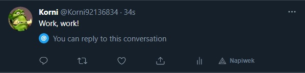
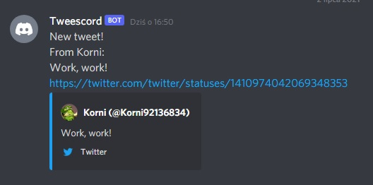
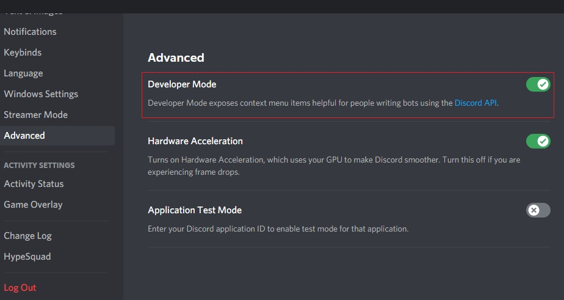

# Tweescord
>Discord bot that will post new tweets to your channel!


## Table of Contents
* [General Info](#general-information)
* [Technologies Used](#technologies-used)
* [Features](#features)
* [Screenshots](#screenshots)
* [Setup](#setup)
* [Usage](#usage)
* [Project Status](#project-status)
* [Room for Improvement](#room-for-improvement)
* [Contact](#contact)
* [License](#license)

## General Information
- Project focuses on combining tweepy's streaming with discord.py bot. With this project you can have a simple way of getting notifications about new tweets, sent by users that you specified in the code. 
- I undertook this project based on my intrest to start working with discord.py. For my first attempt to work with discord bots I wanted to make it do a little more than a couple message commands, so I got the idea to create this project - bot that will notify you of new tweets and in time maybe more...


## Technologies Used
- Python - version 3.9
- Tweepy - version 3.10.0
- Discord.py - version 1.7.1
- Urllib3 - version 1.26.4
- Requests - version 2.25.1


## Features
- Tweepy streamer listens for original user new tweets (no retweets) and pass them to discord bot which will post a message to your discord channel to notify you.


## Screenshots
- That's how it works:  
  
  
Or like this:  


## Setup
Project uses following libraries:
- Tweepy - version 3.10.0
- Discord.py - version 1.7.1
- Urllib3 - version 1.26.4
- Requests - version 2.25.1

There is also requirements.txt file in repository.

You can setup your standard [venv](https://docs.python.org/3/library/venv.html) and install packages from requirements.txt using e.g. PIP.  
```python3 -m venv /path/to/new/virtual/environment```  
```pip install -r requirements.txt```  
Next you can proceed to [usage](#usage) for further configuration.


## Usage
First you should make sure you've set up your bot on discord applicaiton and you have developer account for twitter - you will need theese to fill config.py with your tokens and keys.  
This is how to get the above:  
[Discord Bot](https://discordpy.readthedocs.io/en/stable/discord.html) - follow all the steps so you can get your discord bot token. NOTE: When setting bot permissions you should set at least 'View Channels', 'Send Messages' and 'Embed Links'.  
[Twitter dev account](https://dev.to/sumedhpatkar/beginners-guide-how-to-apply-for-a-twitter-developer-account-1kh7)  


After you obtain your discord token as well as twitter tokens and key, you can fill config.py with your credentials.
```
# your discord token goes here
dc_token = ""

# twitter credentials

# your api key and api key secret go here
api_key = ""
api_secret = ""

# your tokens go here
access_token = ""
access_token_secret = ""
```


Now you can fill the 'following' list in 'def main()' with ID's of whoever you want to follow (NOTE - it is filled with example ID's). To obtain someone's ID you can use e.g. [Twitter ID's](https://tweeterid.com/)
```
def main():
    # list with IDs of people you want to follow
    following = ["44196397",    # Elon Musk
                 "783214",      # Twitter
                 "50393960",    # Bill Gates
                 "10228272",    # Youtube
                 "11348282",]    # NASA 
```


Next you should set a discord channel on your server where notifications will be posted by the bot. To do so first enable developer mode in discord. You can do it by going to 'settings' then 'advanced' and switch developer mode on.


When the mode is switched on, you can obtain channel ID. To get a Channel ID right click the channel and click on “Copy ID”. Alternatively type the channel as a mention and place a backslash \ in front of the mention. It should look like this <#475182341782896651> and the number is the ID.

Now swap your ID with that in the code:
```
@bot.event
async def post_tweet(name, text, id):
    # here goes your channel id
    channel = bot.get_channel(844366850804809738)
    await channel.send(f"New tweet!\nFrom {name}:\n{text}\n"
                       f"https://twitter.com/twitter/statuses/{id}")
```


And that's all! You should be able to execute the code and bot will post messages to the channel you set up when new tweets occur. You can also modify the message above to suit your needs.

## Project Status
Project is: _in progress_ .


## Room for Improvement
Room for improvement:
- Implement program closing in console.
- Exception handling needs a bit polishing.
- Reconnecting the stream after losing connection should be slowed down.

To do:
- Implement bot command inserting usernames to "following" list (converting usernames to id)
- Anything that comes to mind!


## Contact
Created by [@korni121](https://www.github.com/korni121)


## License
This project is open source and available under the [MIT License]().
